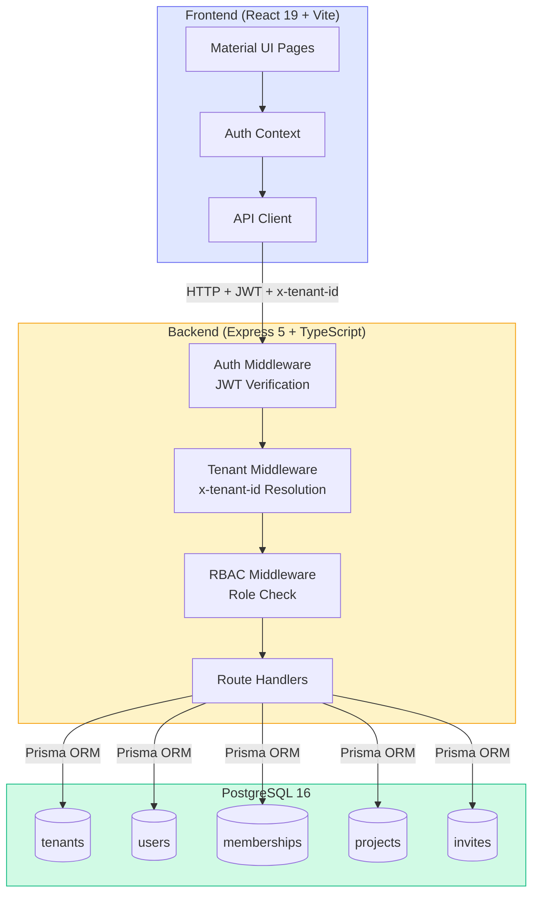
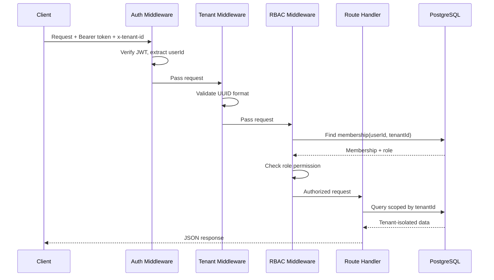
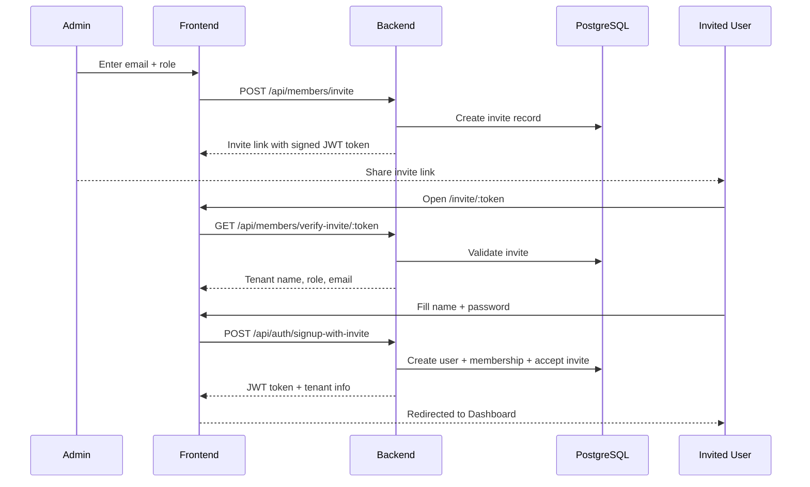
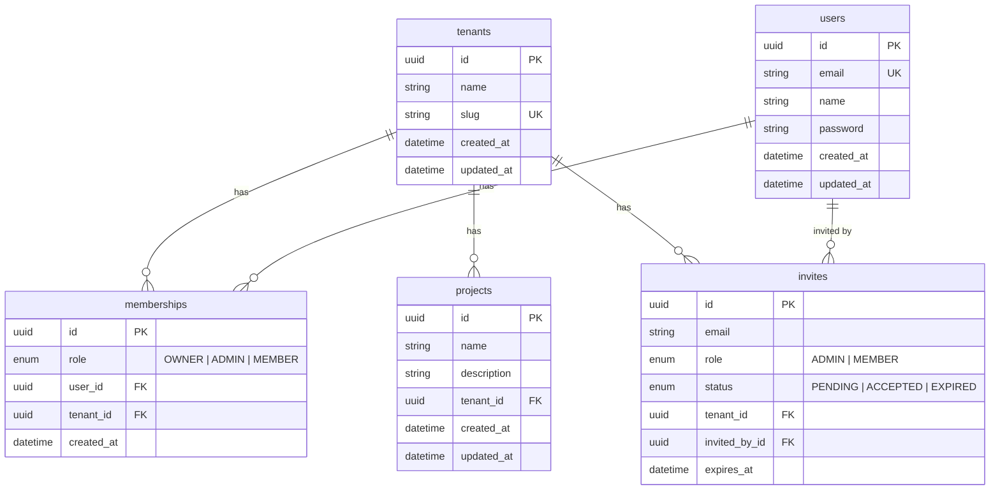

# Multi-Tenant SaaS Starter Kit

A production-ready multi-tenant SaaS boilerplate built with Node.js, React, and PostgreSQL. Demonstrates tenant isolation, role-based access control, invite system, and clean monorepo architecture.

## Architecture



### Request Flow



### Project Structure

```
saas-starter-kit/
├── apps/
│   ├── api/            # Express 5 + Prisma + PostgreSQL
│   └── web/            # React 19 + Vite + Material UI
├── packages/
│   ├── shared/         # Shared types and constants
│   └── typescript-config/
├── docker-compose.yml  # PostgreSQL
└── turbo.json          # Turborepo config
```

## Tech Stack

| Layer         | Technology                                    |
|---------------|-----------------------------------------------|
| Frontend      | React 19, TypeScript, Material UI 7, Vite     |
| Backend       | Node.js, Express 5, TypeScript                |
| Database      | PostgreSQL 16, Prisma ORM                     |
| Auth          | JWT (access tokens), bcrypt password hashing  |
| Monorepo      | Turborepo                                     |
| Infrastructure| Docker Compose                                |

## Features

- **Multi-Tenancy** — shared database with row-level tenant isolation via middleware
- **Authentication** — signup (creates user + tenant), login, JWT-based sessions
- **Role-Based Access Control** — Owner, Admin, Member roles with middleware guards
- **Invite System** — token-based invites with signup-and-join flow
- **Tenant-Scoped CRUD** — projects resource fully isolated per tenant
- **Tenant Switching** — users can belong to multiple tenants
- **Responsive UI** — sidebar layout, mobile-friendly

## API Endpoints

### Auth (public)
| Method | Route                        | Description                        |
|--------|------------------------------|------------------------------------|
| POST   | `/api/auth/signup`           | Create account + tenant (→ Owner)  |
| POST   | `/api/auth/login`            | Login, receive JWT                 |
| POST   | `/api/auth/signup-with-invite` | Create account via invite token  |
| GET    | `/api/auth/me`               | Current user + tenants (authed)    |

### Tenants (requires auth + tenant header)
| Method | Route                  | Role         | Description      |
|--------|------------------------|--------------|------------------|
| GET    | `/api/tenants/current` | Any member   | Tenant details   |
| PATCH  | `/api/tenants/current` | Owner, Admin | Update tenant    |

### Members (requires auth + tenant header)
| Method | Route                           | Role         | Description         |
|--------|---------------------------------|--------------|---------------------|
| GET    | `/api/members`                  | Any member   | List members        |
| POST   | `/api/members/invite`           | Owner, Admin | Invite user         |
| POST   | `/api/members/accept-invite`    | Authed user  | Accept invite       |
| GET    | `/api/members/verify-invite/:token` | Public  | Verify invite token |
| PATCH  | `/api/members/:userId/role`     | Owner        | Change role         |
| DELETE | `/api/members/:userId`          | Owner, Admin | Remove member       |

### Projects (requires auth + tenant header)
| Method | Route                | Role         | Description            |
|--------|----------------------|--------------|------------------------|
| GET    | `/api/projects`      | Any member   | List projects (paginated) |
| GET    | `/api/projects/:id`  | Any member   | Get project            |
| POST   | `/api/projects`      | Owner, Admin | Create project         |
| PATCH  | `/api/projects/:id`  | Owner, Admin | Update project         |
| DELETE | `/api/projects/:id`  | Owner, Admin | Delete project         |

## Getting Started

### Prerequisites
- Node.js 18+
- Docker (for PostgreSQL)

### Setup

```bash
# 1. Install dependencies
npm install

# 2. Start PostgreSQL
docker compose up -d

# 3. Configure environment
cp apps/api/.env.example apps/api/.env
# Edit apps/api/.env and set a real JWT_SECRET

# 4. Run database migrations
cd apps/api
npx prisma migrate dev --name init

# 5. Seed demo data
npx prisma db seed

# 6. Start development servers
cd ../..
npm run dev
```

The API runs on `http://localhost:4000` and the web app on `http://localhost:3000`.

### Demo Credentials

| Email              | Password      | Role  |
|--------------------|---------------|-------|
| owner@demo.com     | password123   | Owner |
| member@demo.com    | password123   | Member|

## How Multi-Tenancy Works

1. **Signup** creates a User + Tenant + Membership (role: OWNER)
2. Every API request includes an `x-tenant-id` header
3. `resolveTenant` middleware extracts and validates the tenant ID
4. `requireMembership` middleware verifies the user belongs to that tenant
5. `requireRole` middleware checks permission level (Owner > Admin > Member)
6. All database queries are scoped to `tenantId` — no cross-tenant data leakage

## Invite Flow



## Database Schema



## License

MIT
